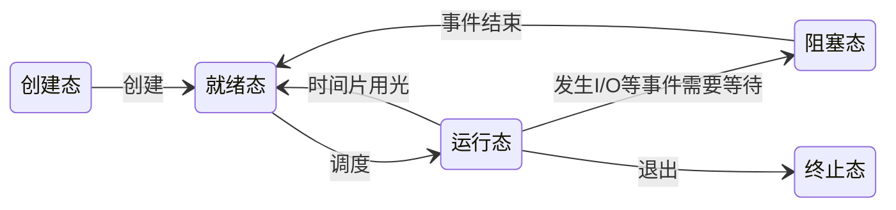

<!--more-->
## 进程与线程
> 进程是系统资源分配的基本单位，线程是系统调度的基本单位。
### 进程的组成
**PCB**：进程控制块，一个描述进程基本情况和运行状态的数据结构。
>[!NOTE]-
>进程由PCB、程序段、相关数据段组成，创建进程就是创建进程的PCB，反之撤销亦然。
>

### 进程的状态



### 进程控制

（实现进程状态转换）
#### 线程组织方式
- 利用指针**链表**式控制，将用的比较多的进程排在前面。（eg：就绪列指针 -> pcb1 -> pcb2）
- 利用索引表控制。

#### 原语概念
利用一个原子化操作，将进程的状态转换。（将指针删除，转移到另一队列，必须原子化）
- 实现方法：关中断/开中断
#### 实现进程控制的原语
理解即可
- 创建原语
  - 申请空白PCB
  - 为新进程分配所需资源
  - 初始化PCB
  - 将PCB插入就绪队列
- 撤销原语
  - 找到终止进程的PCB
  - 若进程正在运行，立即剥夺CPU，将CPU分配给其他进程
  - 终止所有子进程
  - 将该进程的资源全部还给父进程/操作系统
  - 删除PCB
- 阻塞原语
  - 找到PCB
  - 保护进程运行现场，将PCB状态置为阻塞态，暂停进程运行
  - 将PCB插入等待队列
- 唤醒原语
  - 在等待队列种找到PCB并移除
  - 设置进程为就绪态
  - 插入就绪队列
- 切换原语（就绪态和运行态之间）
  - 将运行环境信息**存入PCB**（不是存入内存，是PCB）
  - PCB移入相应队列
  - 选择另一个进程执行，并更新其PCB
  - 根据PCB恢复新进程所需运行环境

### 进程通信

#### 共享存储

- 设置一个共享内存区域，映射到进程的虚拟地址空间
- 通信进程自己负责实现互斥，访问共享空间
- 实现方式
  - 基于数据结构（低级）：规定了某个数据结构，两个进程只能共享这个数据结构类型的数据。
  - 基于存储区共享（高级）：随便怎么用都行。

#### 消息传递
- 传递结构化消息（head/body）
- 系统提供`发送/接受`原语
- 两种方式
  - 直接通信：消息直接挂到接收进程的消息队列中
  - 简接（信箱）通信：消息先发到中间体

#### 管道通信
- 管道：一个内存缓冲区，是一个特殊的共享文件，只能单向使用，互斥使用。
- 进程通过系统调用申请管道。
- 管道有大小，空/满时都会进程阻塞。
- 与共享存储不同在于，是buffer，数据流，先进先出。
- 管道中的数据读了就会消失，所以一个管道允许多个写，一个读

### 线程、多线程模型

#### 线程的属性

- 内核级线程每个线程都有一个id、线程控制块（TCB）
- 由于共享内存地址空间，同一进程中的线程间通信甚至无需系统干预。
- 不同进程中线程切换会引起进程切换
- 线程的状态和转换和进程一模一样

#### 线程的实现方式
- 用户级线程：由线程库纯用户软件实现，不用操作系统，操作系统也不知道有线程
  - 比如123循环，1操作功能1，2操作功能2，3操作功能3
  - 优点：
    - 不需要切换内核，节省开销
    - 调度算法可以用户自定义，灵活
  - 缺点：
    - 系统调用会被阻塞，一个线程执行系统调用，一个进程都要阻塞
    - 不能用多CPU
- 内核级线程：由操作系统完成线程管理，需要在核心态切换线程。有TCB。
  - 优点：
    - 系统调用阻塞一个线程，其它线程还可以执行。
    - 可以利用多个CPU，并发能力强。
  - 缺点：开销大。
- 组合方式：

## CPU调度

### 三层调度（ \* ）

高级：哪个程序变成就绪的进程
中级：哪个进程在内存不足时被移到外存里，哪个移回来
低级：哪个内存中的进程可以用CPU
### 调度实现
#### 时机
##### 需要调度
- 进程主动放弃资源
- 正常终止
- 运行时发生异常而终止
- 主动阻塞（I/O）
- 进程被动放弃资源
- 时间片用完
- 有更紧急的事情（I/O中断etc）
- 优先级更高的进程进入就绪队列
##### 不能调度
- 在处理中断的过程中
- 在操作系统的**内核**程序临界区中（普通临界区可以）
- 临界区是访问临界资源（一个时间段内只有一个进程可以用的资源）的代码
- 原因是对内核临界区上锁时中断，没法释放，会影响管理工作。普通的临界区，可能比如争取一个打印机，调不调度就无所谓。
- 原子操作中
#### 调度器
- 不支持内核级线程的操作系统，调度程序的处理对象是进程
- 支持内核级线程的操作系统，调度程序的处理对象是内核线程
（分为排队器，分派器，上下文切换器）
#### 闲逛进程
调度程序没有其它就绪进程时运行的进程。优先级最低，PID为0，主要是为了让调度程序在每次它的程序结束后检查有没有其它程序。
### 调度评价指标
- CPU利用率
- 系统吞吐量：$\frac{总共完成了多少道作业}{花了多少时间}$
- 周转时间：作业完成时间-作业提交时间
- 平均周转时间：$\frac{周转和}{作业数}$
- 带权周转时间：$\frac{作业周转时间}{作业实际运行时间}$
- 等待时间
- 响应时间
### 调度算法
---
以下是几种关注公平性的算法，主要适合用于早期批处理系统，用户交互体验很差。
#### 先来先服务（FCFS）（First come first serve）
- 按照作业到达先后顺序服务
- 对短作业不友好
- 不会导致饥饿
#### 短作业优先(SJF)(Shortest Job First)
- 最短的最先服务
- 非抢占式，但也有抢占式版本------最短剩余时间优先（SRTN ShortestRemaning Time Next）
- 在所有进程都几乎同时到达时，采用SJIF调度算法的平均等待时间、平均周转时间最少
- 会导致饥饿，甚至饿死。
#### 高响应比优先（HRRN）(Highest Response Ratio Next)
- 综合考虑作业/进程的等待时间和要求服务时间
- 在**每次调度**时先计算各个作业/进程的**响应比**（$\frac{等待时间+运行时间}{运行时间}$），选最大的
- 非抢占式
- 不会导致饥饿
---
下面是比较现代的算法，主要用于分时操作系统
#### 时间片轮转（RR）（Round-Robin）
- 按进程到达就绪队列的顺序，轮流让各个进程执行一个时间片。时间内没执行完就放在队尾。
- 用于进程调度
- 抢占式
- 优点：公平，响应快。缺点：高频率进程切换有开销，而且不区分任务紧急程度
- 不会导致饥饿
#### 优先级调度算法
- 为每个作业/进程分配不同优先级，选择优先级高的调度。
- 非抢占和抢占式都有
- 有静态与动态两种
- 通常前台进程高于后台进程，I/O型高于计算型
- 优点是灵活；缺点是导致饥饿
#### 多级反馈队列调度算法
- （繁琐的）步骤（但我相信你看一眼就懂了）
- 设置多级就绪队列，各级队列优先级从高到低，时间片从小到大
- 新进程到达时先进入第1级队列，按FCFS原则排队等待被分配时间片，若用完时间片进程还未结束，则进程进入下一级队列队尾，如果此时已经是在最下级的队列，则重新放回该队列队尾。
- 只有第k级队列为空时，才会为k+1级队头的进程分配时间片
- 抢占式算法，如果比当前运行等级高的队列里突然来了进程，会首先处理高等级进程，原来运行的进程放入当前队尾（不用降级）。
- 优点：公平、灵活、不用估计进程运行时间（避免用户作假）、周转时间少......反正牛逼
- 会导致饥饿
#### 多级队列调度
- 固定优先级分队列，或者不同队列分不同的时间片，也可以分不同的调度策略。
- 感觉像多级反馈的青春版。
## 进程的同步与互斥
### 临界资源
访问过程可以分为四个部分：
- 进入区：检查是否可以进入临界区，如果可以进入则上锁
- 临界区：访问临界资源代码
- 退出区：解锁
- 剩余区：其余代码
### 互斥实现需要遵循原则
空闲让进、忙则等待、有限等待（防止饥饿）、让权等待（进不了临界区的进程，要释放处理机，防止忙等。）
### 互斥的软件实现方法（ \* ）
（这部分其实看代码更容易理解。）
#### 单标志

两个进程在访问完临界区后会把使用临界区的权限转交给另一个进程。也就是说每个进程进入临界区的权限只能被另一个进程赋予。

**缺点**：违背*空闲让进*原则，如果一个进程不想进了，另一个进程也进不去。
#### 双标志先检查
设置一个布尔型数组flagl，数组中各个元素用来标记各进程想进入临界区的意愿，比如"flag\[0\]=ture"意味着0号进程现在想要进入临界区。每个进程在进入临界区之前先检查当前有没有别的进程想进入临界区，如果没有，则把自身对应的标志flag\[i\]设为true，之后开始访问临界区。

**缺点**：容易同时进入临界区，因为没有原子化操作判断与标记两个步骤。（比如1526这种顺序）
#### 双标志后检查
把上面的判断标记步骤反过来。

**缺点**：饥饿了。
#### Peterson算法

缺点：解决了之前所有问题，但是没进入临界区的那个进程还是会陷入等待，一直占用CPU。
#### 互斥锁
并不是一个方法，是一个概念。就是bool变量。
其中需要忙等的锁叫自旋锁。
### 互斥的硬件实现方法
#### 中断屏蔽
关中断->临界区->开中断
缺点：不适用于多处理机；只适用于操作系统内核进程，不适用于用户进程（因为开/关中断指令只能运行在内核态，这组指令如果能让用户随意使用会很危险）
#### TestAndSet
硬件指令，翻译成c语言如下：优点：TSL是原子执行（硬件做的）实现简单，无需像软件实现方法那样严格检查是否会有逻辑漏洞；适用于多处理机环境。
缺点：不满足让权等待。
#### Swap（Exchange）
硬件指令，翻译成c语言如下：和TSL逻辑上没什么区别，就是实现不同。
### 信号量
为了解决"让权等待问题"发明的。它是一个变量，用来表示系统中某种资源的数量。再搭配PV操作（P：wait，V：signal）实现一套机制。信号量只有特定的原语（PV）可以访问。
#### 整型信号量

缺点：还是会忙等。
#### 记录型信号量

``` c
/*记录型信号量的定义*/
typedef struct {
    int value;  //剩余资源数
    struct process *L;  //等待队列
} semaphore;

/*某进程要使用资源时，通过wait原语申请*/
void wait(semaphore S) {
    S.value--;  //注意一定先做减法
    if (S.value < 0) {  //剩余资源数不够时
        block(S.L);  //使当前进程进入阻塞态，并挂入信号量S的等待队列（阻塞队列）中
    }
}

/*当某进程使用完资源后，通过signal原语释放*/
void signal(semaphore S) {
    s.value++;  //一定先做加法
    if (S.value <= 0) {  //还有人在排队
        wakeup(S.L);  //唤醒队列中的进程
    }
}
```

非常完美，满足了让权等待。
一般来说，题目里没特意强调都是指记录型信号量
#### 信号量应用
##### 进程互斥

``` c
semaphore mutex = 1;

P1(){
    ...
    P(mutex);
    临界区代码段……
    V(mutex);
    ...
}

P2(){
    ...
    P(mutex);
    临界区代码段……
    V(mutex);
    ...
}
```

用PV夹住
##### 进程同步

前V后P
##### 进程前驱关系
同步的扩展。多设几个信号量，前V后P。
### 经典同步问题
#### 生产者-消费者



系统中有一组生产者进程和一组消费者进程，生产者进程每次生产一个产品放入缓冲区，消费者进程每次从缓冲区中取出一个产品并使用。


这个问题的难点在于想到有两个同步信号量。不能把P(mutex)放在P(empty/full)前面。因为这相当于不管有没有资源，我都要拿着进入缓冲区的钥匙。就导致死锁。
V操作可以交换。
#### 多生产者-多消费者



桌子上有一只盘子，每次只能向其中放入一个水果。爸爸专向盘子中放苹果，妈妈专向盘子中放橘子，儿子专等着吃盘子中的橘子，女儿专等着吃盘子中的苹果。只有盘子空时，爸爸或妈妈才可向盘子中放一个水果。仅当盘子中有自已需要的水果时，儿子或女儿可以从盘子中取出水果。



这个也不难，*只要遵循同步前V后P，互斥PV夹住*就可以了。
缓冲区大小为1，所以不需要专门设置mutex。
#### 吸烟者



假设一个系统有三个抽烟者进程和一个供应者进程。每个抽烟者不停地卷烟并抽掉它，但是要卷起并抽掉一支烟，抽烟者需要有三种材料：烟草、纸和胶水。三个抽烟者中，第一个拥有烟草、第二个拥有纸、第三个拥有胶水。供应者进程无限地提供三种材料，供应者每次将两种材料放桌子上，拥有剩下那种材料的抽烟者卷一根烟并抽掉它，并给供应者进程一个信号告诉完成了，供应者就会放另外两种材料再桌上，这个过程一直重复（让三个抽烟者轮流地抽烟）



第一次看见这个题的时候在想，把一个变量设置为一个信号量，然后P两次。这样的思路是完全错误的，因为如果想要保证P两次的操作是原子性，且不占用资源的话，那要相当费工夫，都要上状态机了。
*正确的思路是*，把一个组合设置为一个信号量，问题就会迎刃而解。
这个问题的精华是：*轮流*让吸烟者抽烟。如果是随机抽烟的话，就要改一下provider的代码，加一个随机数并把P（）放在if里面了。
#### 读者-写者



有读者和写者两组并发进程，共享一个文件，当两个或两个以上的读进程同时访问共享数据时不会产生副作用，但若某个写进程和其他进程（读进程或写进程）同时访问共享数据时则可能导致数据不一致的错误。因此要求：

1. 允许多个读者可以同时对文件执行读操作
2. 只充许一个写者往文件中写信息
3. 任一写者在完成写操作之前不允许其他读者或写者工作
4. 写者执行写操作前，应让已有的读者和写者全部退出。



问题：写进程容易饿死
其核心思想在于设置了一个计数器count用来记录当前正在访问共享文件的读进程数。我们可以用count的值来判断当前进入的进程是否是第一个/最后一个读进程，从而做出不同的处理。
#### 哲学家进餐



一张圆桌上坐着5名哲学家，每两个哲学家之间的桌上摆一根筷子，桌子的中间是一碗米饭。哲学家们倾注毕生的精力用于思考和进餐，哲学家在思考时，并不影响他人。只有当哲学家饥饿时，才试图拿起左、右两根筷子（一根一根地拿起）。如果筷子已在他人手上，则需等待。饥饿的哲学家只有同时拿起两根筷子才可以开始进餐，当进餐完毕后，放下筷子继续思考。


如何避免临界资源分配不当造成的死锁现象（同时拿起了左边的筷子），是哲学家问题的精髓。
1. 可以对哲学家进程施加一些限制条件，比如最多允许四个哲学家同时进餐。这样可以保证至少有一个哲学家是可以拿到左右两只筷子的。
2. 要求奇数号哲学家先拿左边的筷子，然后再拿右边的筷子，而倡数号哲学家刚好相反。用这种方法可以保证如果相邻的两个奇偶号哲学家都想吃饭，那么只会有其中一个可以拿起第一只筷子，另一个会直接阻塞。
3. 仅当一个哲学家左右两支筷子都可用时才允许他抓起筷子
### 管程
信号量编程困难，容易出错，所以创造了管程，让程序员轻松写码。
简单的来说，管程是一个数据结构，可以看成一个共享的、拥有构造函数的类。
#### 管程的基本特征
1. 管程的数据只能被管程内的过程所访问、修改。
2. 每次仅允许一个进程在管程内执行某个内部过程。

## 死锁

### 死锁的条件

各进程互相等待对方手里的资源，导致各进程都阻塞，无法向前推进。
#### 四大要素
1. 互斥
2. 资源不能被剥夺
3. 请求和保持：吃着碗里的想着锅里的
4. 循环等待
### 处理策略
#### 预防死锁
预防的思路主要是破坏四大要素。
- 破坏互斥：SPOOLing技术（实用性不大，很难实现+条件不允许）
- 破坏不剥夺：
- 方案1：申请的资源得不到满足时，立即释放拥有的所有资源。
- 方案2：申请的资源被其他进程占用时，由操作系统协助剥夺（考虑优先级）
- 缺点：实现复杂；剥夺资源可能导致部分工作失效；反复申请和释放导致系统开销大；可能导致饥饿。
- 破坏请求和保持条件：运行前分配好所有资源，之后一直保持。（不灵活、资源利用率低）
- 破坏循环等待条件：给资源编号，按号给资源。（浪费资源，而且编程麻烦，不方便添加新设备。）
#### 避免死锁（银行家算法）（ \* ）
安全性算法：反正就是一个一个演算一下，找还有没有安全序列。如果都能加入序列，就不可能发生死锁。

银行家算法：
1. 检查此次申请是否超过了之前声明的最大需求数
2. 检查此时系统剩余的可用资源是否还能满足这次请求
3. 试探着分配，更改各数据结构
4. 用安全性算法检查此次分配是否会导致系统进入不安全状态

什么，忘了啥意思且看不懂这些字？请看[vcr](https://www.bilibili.com/video/BV1YE411D7nH?t=85.6&p=40)
#### 死锁的检测与解除
##### 检测
利用资源分配图，一点一点看，从能满足的点开始看，看能不能把所有边都消去。可以的话称图为可完全简化的。不可以则死锁。
##### 解除
- 资源剥夺法：挂起（暂时放到外存上）某些死锁进程，并抢占它的资源，将这些资源分配给其他的死锁进程。但是应防止被挂起的进程长时间得不到资源而饥饿。
- 撤销进程法：强制撤销部分、甚至全部死锁进程，并剥夺这些进程的资源。这种方式的优点是实现简单，但所付出的代价可能会很大。因为有些进程可能已经运行了很长时间，已经接近结束了，一旦被终止可谓功亏一簧，以后还得从头再来。
- 进程回退法。让一个或多个死锁进程回退到足以避免死锁的地步。这就要求系统要记录进程的历史信息，设置还原点。


1. 进程优先级
2. 已执行多长时间
3. 还要多久能完成
4. 进程已经使用了多少资源
5. 进程是交互式的还是批处理式的

